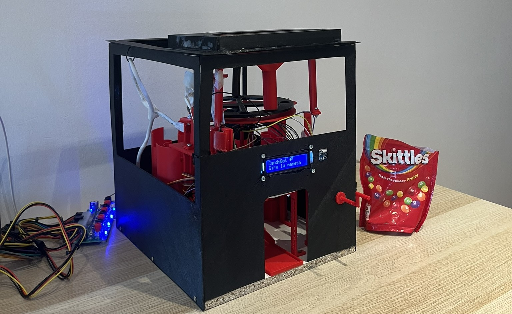

# CandyBot

A voice-controlled candy dispenser built on a Raspberry Pi. A user asks for sweets out
loud — in **Catalan or Spanish** — and the robot serves the requested colours and amounts.
It also sorts itself: a rotating tray feeds Skittles one by one past a camera, reads
each colour, and drops it into the matching container.

Developed for the **Robotics Lab (RLP)** course at the Universitat Autònoma de Barcelona.



[▶ Watch the demo](https://youtu.be/PrirMlMhzKU) *(Catalan with English subtitles)*

> **Autism & HRI.** Sorting and ordering objects is a well-documented self-regulatory
> behavior across the autism spectrum — it introduces predictability into a sensory
> environment that can feel overwhelming, and the act of categorising provides a
> satisfying, calming loop. CandyBot engages that same tendency in a playful context,
> while also offering a novel interaction modality: voice combined with a physical crank,
> which reduces the social pressure of direct human interaction.
>
> Color choices were informed by consultations with professionals in the field. Research
> shows that highly saturated or bright colors can be overstimulating for many individuals
> with ASD, while neutral, muted tones tend to be more comfortable. That said, autism is
> a broad spectrum and no single palette works universally — a conclusion reinforced by
> the professionals consulted during development. The robot's exterior is therefore black:
> visually quiet, non-imposing, and unobtrusive in any environment. The interior uses red
> accents to draw the user's attention and spark curiosity, without making the robot
> visually dominant in the space around it.

---

# Table of Contents

- [How it works](#how-it-works)
- [System architecture](#system-architecture)
  - [Pi software (BotSoftware)](#pi-software-botsoftware)
  - [Cloud API](#cloud-api)
- [Colour vision](#colour-vision)
  - [Detection pipeline](#detection-pipeline)
  - [HSV classification](#hsv-classification)
- [3D designs](#3d-designs)
- [Dispensing flow](#dispensing-flow)
- [Reload / self-sorting flow](#reload--self-sorting-flow)
- [Stock management](#stock-management)
- [Repository layout](#repository-layout)
- [Hardware](#hardware)
  - [Bill of materials](#bill-of-materials)
  - [Servo channel map](#servo-channel-map)
  - [Wiring defaults](#wiring-defaults)
- [The API](#the-api)
  - [Endpoint reference](#endpoint-reference)
  - [LLM prompt design](#llm-prompt-design)
  - [Deployment](#deployment)
- [Running the robot](#running-the-robot)
  - [Requirements](#requirements)
  - [Configuration](#configuration)
  - [Start](#start)
  - [Testing subsystems individually](#testing-subsystems-individually)
  - [Developing without hardware](#developing-without-hardware)
- [Team](#team)
- [License](#license)

---

# How it works

```
┌──────────────────────────────────────────────────────────────────┐
│  1. User turns crank   →  reed switch pulses  →  Pi starts rec.  │
│  2. Crank stops        →  WAV clip posted to Cloud API           │
│  3. API: STT           →  Gemini LLM          →  JSON command    │
│  4. Pi: dispense / reload / cancel            →  LCD feedback    │
└──────────────────────────────────────────────────────────────────┘
```

1. **Crank input.** A magnet sweeps past a reed switch once per revolution.
   The Pi counts pulses to detect user activity and starts recording automatically
   — no buttons, no touch screen.

2. **Recording.** While the crank is turning, audio is streamed to a buffer.
   When the crank stops, the clip is closed and sent as a WAV file to the
   CandyBot API over HTTPS.

3. **Language understanding.** The API pipeline has two stages:
   - **Speech-to-Text (Google STT v2)** transcribes the audio, tuned for Catalan
     (`ca-ES`).
   - **Gemini 2.5 Flash (Vertex AI)** reads the transcript and emits a strict JSON
     command describing what the user asked for.

4. **Execution.** The Pi interprets the JSON command and runs the matching flow:
   dispense specific colours and amounts, run the self-sorting reload routine, or
   do nothing if the intent was unclear.

Throughout the interaction the LCD screen shows the current state (idle, listening,
dispensing a colour, low stock warning, etc.).

---

# System architecture

## Pi software (BotSoftware)

The on-device code follows a **controller-per-subsystem** pattern. Each controller
owns one piece of hardware and exposes a small, stable interface to the rest of
the system.

```
BotSoftware/main.py
  │
  ├── crank_controller   — GPIO reed switch, wait_for_turn(), is_turning()
  ├── display_controller — 16×2 LCD, named states (idle, listening, dispensing…)
  ├── candy_controller   — stock check → servo dispatch → stock update
  ├── reload_controller  — disk + camera loop with voice-cancel support
  ├── servo_controller   — PCA9685 driver, dispense(color, qty), ramp_to(color)
  └── vision_controller  — picamera2 frame capture + ROI colour classification
```

The main loop is intentionally simple:

```python
while True:
    display.idle()
    crank.wait_for_turn()          # blocks until crank spins
    display.listening()
    response = api_client.record_and_send_while(crank.is_turning)

    if response["action"] == "dispense":
        candy_controller.dispense(response["items"])
    elif response["action"] == "reload":
        reload_controller.reload_with_voice_cancel()
    # cancel / nothing → loop back
```

## Cloud API

The API is a **FastAPI** application containerised with Docker and deployed to
**Google Cloud Run**. It is stateless: each request is fully self-contained.

```
POST /v1/command
  │
  ├── validate content-type and file size
  ├── Google STT v2  →  transcript (str)
  ├── Gemini 2.5 Flash  →  raw JSON (str)
  ├── pydantic parse + validate  →  CandyBotResponse
  └── return JSON response
```

Request authentication uses a shared secret passed in the `X-API-Token` header.
Timing for each stage (STT, LLM, total) is logged at INFO level on every request.

---

# Colour vision

## Detection pipeline

The vision system runs a **persistent picamera2 stream** at ~30 fps with fixed
exposure and gain, ensuring colour consistency across frames. During reload, the
system inspects a small ROI at a fixed position in the frame — the point where
each candy slot passes under the lens.

```
picamera2 frame (640 × 480)
  │
  ├── extract ROI  (centred at 40 % × 50 % of frame, radius 7 % of width)
  ├── convert BGR → HSV
  ├── compute median H, S, V across the ROI
  │
  ├── reject: H ≤ 12                        → disk hue wrapping near 0
  ├── reject: H 148–179 + V < 130 + S < 200 → black disk surface
  ├── reject: V < 20                         → too dark (shadow / gap)
  ├── reject: S < 120                        → empty slot / background
  │
  └── classify: nearest reference hue (circular distance) → colour name
```

A **two-consecutive-frames** confirmation rule (in `reload_controller`) prevents
stray reflections or partial coverage from triggering a wrong bin assignment.

## HSV classification

OpenCV uses H ∈ [0, 179]. Each colour is represented by a single reference hue;
classification picks the closest one by circular distance.

| Colour | Default reference hue |
|--------|-----------------------|
| green  | 45 |
| yellow | 95 |
| orange | 121 |
| red    | 135 |
| purple | 172 |

Reference hues are loaded at startup from `BotSoftware/VC/color_calibration.json`
if the file exists. Run `HW tests/calibrar_colores.py` to measure and save the
per-unit hues for your specific camera and lighting conditions.

---

# Dispensing flow

When the command action is `"dispense"`:

```
candy_controller.dispense(items)
  │
  ├── guard: items list empty?  →  display.empty_command()
  ├── check_availability(items) against SQLite stock
  │     not ok  →  display.low_stock(color, available)  →  return
  │
  └── for each item:
        display.dispensing(color, qty)
        servo_controller.dispense(color, qty)   # SG90 pulses
        (loop qty times, one candy per pulse)
  │
  └── consume_from_command(items)   →  update SQLite
```

`servo_controller.dispense` sends a calibrated angular pulse to the SG90 on the
matching PCA9685 channel. Each pulse ejects exactly one Skittle from its cylinder.
The number of pulses equals the requested quantity.

---

# Reload / self-sorting flow

When the command action is `"reload"`, the robot enters the self-sorting routine.
A background thread simultaneously listens for a voice `"cancel"` command so the
user can stop the reload early by turning the crank and saying "para".

```
reload_with_voice_cancel()
  │
  ├── spawn listener thread:
  │     while not cancelled and not done:
  │         if crank.is_turning():
  │             record → API → if action=="cancel": set cancel_event
  │
  └── reload_once(should_cancel=cancel_event.is_set)
        │
        ├── vision_controller.start()   (open camera)
        ├── servo_controller.disk_start()   (continuous servo)
        │
        ├── loop:
        │     detect_color() → color
        │     require two consecutive same-colour frames (anti-flicker)
        │     if confirmed and armed:
        │         sleep DISK_RAMP_DELAY_S   (candy travels to ramp)
        │         servo_controller.ramp_to(color)
        │         candy_stock.add_candy(color, 1)
        │         display.reloading(stock, color)
        │         armed = False
        │     if no candy for DISK_REARM_S  →  armed = True
        │     if no candy for DISK_EMPTY_TIMEOUT_S  →  break (tray empty)
        │     sleep CAMERA_INTERVAL_S
        │
        └── disk_stop() · ramp_center() · vision_controller.release()
```

All timing constants (`DISK_RAMP_DELAY_S`, `DISK_REARM_S`, `DISK_EMPTY_TIMEOUT_S`,
`CAMERA_INTERVAL_S`) are defined in `BotSoftware/config/servo_config.py` so they
can be tuned without touching controller logic.

---

# Stock management

Stock is persisted in a **SQLite database** (`BotSoftware/candy_stock.db`).
The schema is a single table:

```sql
CREATE TABLE stock (
    color    TEXT PRIMARY KEY,
    quantity INTEGER NOT NULL DEFAULT 0 CHECK (quantity >= 0)
);
```

Five rows are seeded on first use (red, orange, yellow, green, purple).
The public API exposed by `BotSoftware/models/candy_stock.py`:

| Function | Description |
|----------|-------------|
| `get_stock(color=None)` | Return quantity for one colour, or a dict of all five |
| `add_candy(color, qty)` | Increment stock (called by reload loop) |
| `remove_candy(color, qty)` | Decrement stock (called after dispensing) |
| `set_stock(color, qty)` | Overwrite a single colour (calibration / tests) |
| `set_all(qty)` | Set every colour to the same value |
| `reset()` | Empty all stock (every colour → 0) |
| `check_availability(items)` | Return `{ok, missing}` before dispensing |
| `consume_from_command(items)` | Atomic check-and-remove for a full command |

The `CHECK (quantity >= 0)` constraint in SQLite means stock can never go
negative at the database level, even if a software bug skips the availability
check.

---

# Repository layout

```
CandyBot/
│
├── BotSoftware/                Code that runs on the Raspberry Pi
│   ├── main.py                 Entry point — the main loop
│   ├── candy_stock.db          SQLite stock database (created on first run)
│   ├── config/
│   │   └── servo_config.py     I2C addresses, GPIO pins, timing constants
│   ├── controllers/
│   │   ├── candy_controller.py   Dispense flow
│   │   ├── crank_controller.py   Reed switch input
│   │   ├── display_controller.py LCD states
│   │   ├── reload_controller.py  Self-sorting flow
│   │   ├── servo_controller.py   PCA9685 / SG90 driver
│   │   └── vision_controller.py  Camera capture + colour classification
│   ├── models/
│   │   └── candy_stock.py        SQLite stock access layer
│   ├── services/
│   │   └── api_client.py         Audio recording + HTTP post to API
│   └── VC/                       Vision module
│       ├── camera_stream.py      Picamera2 continuous capture
│       ├── color_centre.py       ROI extraction + HSV hue classification
│       ├── color_calibration.json  Per-unit hue calibration (generated)
│       └── prototypes/           Standalone development scripts
│
├── Software/
│   └── Api/                        Cloud service (FastAPI + Docker)
│       ├── main.py                 FastAPI app, /v1/command endpoint
│       ├── config.py               Settings via environment variables
│       ├── models.py               Pydantic response schema
│       ├── Dockerfile              Container definition
│       ├── pyproject.toml          Poetry dependencies
│       └── services/
│           ├── llm_client.py       Vertex AI / Gemini 2.5 Flash client
│           ├── speech_to_text.py   Google STT v2 client
│           ├── parse_and_validate.py   JSON parse + pydantic validation
│           ├── prompt_loader.py    Load system prompt from file
│           └── system_prompt.txt   LLM system prompt
│
├── HW tests/                   Standalone hardware verification scripts
│   ├── test_palanca.py         Crank / reed switch
│   ├── test_ordenar.py         Full sorting cycle (tray + camera + ramp)
│   ├── test_pantalla.py        LCD display
│   ├── control_servo_basic.py  Raw servo movement
│   ├── control_pantallaLCD_basic.py  Raw LCD output
│   ├── calibrar_colores.py     Calibrate per-unit colour reference hues
│   └── ver_colores.py          Live colour detection preview
│
└── 3D Models/                  Printable parts (.stl) — being finalised
```

---

# Hardware

## Bill of materials

| Qty | Part | Role |
|-----|------|------|
| 1 | Raspberry Pi 4 (4 GB) | Central controller |
| 1 | Raspberry Pi Camera Module v2 | Colour detection |
| 1 | PCA9685 16-ch PWM driver (I2C) | Servo bus |
| 5 | SG90 servo | Candy dispensers (one per colour) |
| 1 | SG90 servo | Directional ramp |
| 1 | Continuous-rotation servo (360°) | Sorting tray disk |
| 1 | 16×2 character LCD + PCF8574 I2C backpack | User feedback |
| 1 | USB sound card + electret microphone | Voice input |
| 1 | Reed switch + neodymium magnet | Crank activity detection |
| — | 5 V power supply (≥ 3 A) | Servo rail |

## Servo channel map

| PCA9685 channel | Servo | Colour |
|-----------------|-------|--------|
| 0 | Dispenser | green |
| 1 | Dispenser | purple |
| 2 | Dispenser | red |
| 3 | Dispenser | orange |
| 4 | Dispenser | yellow |
| 5 | Ramp | — |
| 6 | Sorting disk | — |

Channels 5 and 6 are assigned during assembly and may differ per build.
Verify against `BotSoftware/config/servo_config.py` before first run.

## Wiring defaults

| Component | Default address / pin |
|-----------|-----------------------|
| PCA9685 | I2C `0x40` |
| LCD | I2C `0x3F` |
| Reed switch | GPIO 17 (BCM) |
| Microphone | ALSA `plughw:1,0` |
| Camera | Pi camera port (CSI), via picamera2 |

Find your microphone device with `arecord -l`. Update `servo_config.py` if your
I2C addresses differ (use `i2cdetect -y 1` to scan the bus).

---

# 3D designs

All structural and mechanical parts are custom-designed for this project from
scratch. Designs stem from research and inspiration from existing mechanisms,
adapted and shaped to fit CandyBot's specific requirements.

The final design comprises around **29 distinct printable parts**, though many more
were designed along the way — early prototypes, intermediate versions, and parts
that were later corrected or replaced as the design evolved.

Each part went through several design iterations, guided by two priorities:
**ease of maintenance** — individual parts can be removed and replaced without
disassembling the whole robot — and **robust assembly**, using screwed joints
throughout to avoid snap fits that degrade over time.

Dimensional accuracy was especially critical for the moving mechanisms. The
sorting tray, the dispensers, and the directional ramp all depend on tight
tolerances: even small deviations in a sliding or rotating part introduce
friction that disrupts the timing of the sorting cycle.

<table>
  <tr>
    <td></td>
    <td></td>
    <td></td>
  </tr>
  <tr>
    <td></td>
    <td></td>
    <td></td>
  </tr>
</table>

STL files are available in `3D Models/`.

> **Note:** The sorting disk shown in some renders is an earlier single-slot design that required the disk to oscillate back and forth for each candy. The final version uses a **continuous-rotation disk with 4 slots**, eliminating the back-and-forth motion and multiplying sorting throughput by 4×.

---

# The API

## Endpoint reference

### `GET /health`

Health check. Returns `{"status": "ok", "service": "CandyBot API"}`. No authentication required.

### `POST /v1/command`

Convert a voice clip to a structured candy command.

**Authentication:** `X-API-Token: <token>` header (required).

**Request body:** `multipart/form-data`

| Field | Type | Description |
|-------|------|-------------|
| `audio` | file | WAV audio clip. Content-Type must start with `audio/`. Max size controlled by `MAX_AUDIO_BYTES` env var. |

**Response** `200 OK`:

```json
{
  "action":     "dispense",
  "confidence": 0.95,
  "items": [
    { "color": "red",    "quantity": 2 },
    { "color": "yellow", "quantity": 1 }
  ]
}
```

| Field | Type | Values |
|-------|------|--------|
| `action` | string | `dispense` · `reload` · `cancel` · `nothing` |
| `confidence` | float | 0.0 – 1.0, LLM self-reported |
| `items` | array | Only present when `action == "dispense"` |

**Error responses:**

| Status | Cause |
|--------|-------|
| 400 | Invalid content-type, empty file, or file too large |
| 401 | Missing or invalid `X-API-Token` |
| 422 | LLM returned a response that failed schema validation |
| 502 | Upstream STT or LLM request failed |

## LLM prompt design

The system prompt (`Software/Api/services/system_prompt.txt`) instructs Gemini to:

- Output **only valid JSON**, matching the `CandyBotResponse` schema.
- Map colour names from Catalan and Spanish to the canonical English set
  (`red`, `orange`, `yellow`, `green`, `purple`).
- Set `action = "nothing"` when the intent is unclear or unrelated.
- Set `action = "cancel"` when the user explicitly wants to stop.
- Report a `confidence` value reflecting certainty about the parsed intent.

The LLM is called with `response_mime_type: "application/json"` so that
Gemini returns structured output natively, reducing parse failures.

## Deployment

The API is containerised and tested to run on **Google Cloud Run** (minimum
512 MB memory; the STT and Vertex AI clients add no in-process weight beyond
the Python SDK).

**Environment variables:**

| Variable | Required | Default | Description |
|----------|----------|---------|-------------|
| `GCP_PROJECT` | yes | — | Google Cloud project ID |
| `GCP_LOCATION` | no | `europe-west1` | Region for Vertex AI |
| `API_TOKEN` | yes | — | Shared secret for authentication |
| `MAX_AUDIO_BYTES` | no | `10485760` | Max upload size (10 MB) |
| `LLM_MODEL` | no | `gemini-2.5-flash` | Vertex AI model name |

**Required Google Cloud APIs:** Speech-to-Text v2, Vertex AI.

Build and run locally:

```bash
cd Api
docker build -t candybot-api .
docker run -p 8080:8080 \
  -e GCP_PROJECT=my-project \
  -e GCP_LOCATION=europe-west1 \
  -e API_TOKEN=mysecret \
  candybot-api
```

---

# Running the robot

## Requirements

- Raspberry Pi running **Raspberry Pi OS** (Bookworm or later), Python 3.11+
- Hardware connected and verified (see [Hardware](#hardware))
- Python packages:

  ```
  requests
  python-dotenv
  gpiozero
  adafruit-servokit
  RPLCD
  opencv-python
  picamera2
  ```

- System tools (pre-installed on Raspberry Pi OS):

  ```
  arecord   # ALSA audio recording
  ```

Install Python dependencies:

```bash
pip install requests python-dotenv gpiozero adafruit-servokit RPLCD opencv-python picamera2
```

## Configuration

Create a `.env` file inside `BotSoftware/`:

```env
API_URL=https://<your-cloud-run-url>/v1/command
API_TOKEN=<the same token configured in the API>
```

Review `BotSoftware/config/servo_config.py` and verify that I2C addresses,
GPIO pin, microphone device, and servo channels match your build before
the first run.

## Start

```bash
python -m BotSoftware.main
```

The robot enters idle state, waits for crank input, then loops indefinitely.

## Testing subsystems individually

Before a full run it is recommended to verify each subsystem in isolation:

```bash
# Crank / reed switch
python "HW tests/test_palanca.py"

# LCD display
python "HW tests/test_pantalla.py"

# Sorting cycle: tray motor, camera, ramp
python "HW tests/test_ordenar.py"

# Dispense one candy of each colour
python -m BotSoftware.controllers.servo_controller

# Microphone + speech-to-text smoke test
python "HW tests/speech_to_text.py"

# Raw servo movement
python "HW tests/control_servo_basic.py"
```

## Developing without hardware

Every controller guards its hardware import with a try/except. If a component
(PCA9685, LCD, camera, GPIO) is not found, the controller prints a `[NO HW]`
notice and continues in **simulation mode** — methods become no-ops or return
dummy values. This means the full software stack can be run and tested on any
machine, even without a Raspberry Pi attached.

---

# Team

Developed at the Robotics Lab (RLP), Universitat Autònoma de Barcelona.

| Role | Name |
|------|------|
| Software Lead | Pol Montesó Tarrida |
| Hardware Lead | Xavi Umbert Medina |
| 3D Parts & Mechanical Lead / Product Owner | Lluc Bertran Canicio |
| Testing & Validation Lead | Matheus Henrique Mingorance Maciel |
| Vision Lead | Matheus Henrique Mingorance Maciel |

See [Roles.md](Roles.md) for full role descriptions.

---

# License

MIT
